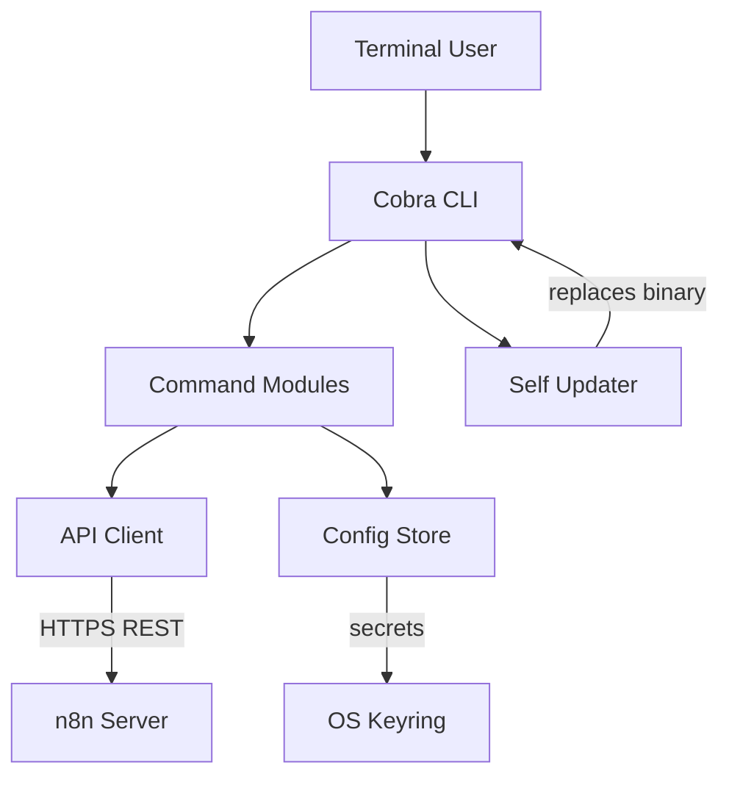

# Blueprint: savvautops/n8n-cli

_Auto-generated architectural documentation — 2026-09-24 (Phase 1). Built from the repository file tree, README and manifests._

## Diagram

## How it works

n8n-cli is a Go command-line client for the n8n Public API (a fork of SomeoneWithOptions/n8n-cli). It gives 1:1 coverage of the n8n REST API — workflows, executions, credentials, users, variables, data tables, projects, source control — plus CLI-only extensions like auth management, self-update, shell completion, and workflow diffing.

The architecture follows the standard Cobra CLI pattern: `cmd/n8n/main.go` is the entry point, `internal/cli` wires up one command module per API domain (`workflow.go`, `execution.go`, `credential.go`, …), and `internal/n8n` holds the shared HTTP client, pagination, and error handling. Auth state lives in `internal/config` with secrets in the OS keyring (`internal/config/keyring.go`, platform-specific secure storage). Docs in `docs/` are generated from command help text via `make docs`. Releases ship as plain per-platform binaries with checksums, and `n8n update` can replace the binary in place.

## Key files

- `cmd/n8n/main.go` — CLI entry point
- `internal/cli/` — one command module per API domain (`workflow.go`, `execution.go`, `credential.go`, …)
- `internal/n8n/client.go` — shared HTTP client, pagination, errors
- `internal/config/` — contexts, credential storage, OS keyring integration
- `internal/workflowdiff/` — workflow diff helper
- `internal/selfupdate/` — in-place binary updater
- `docs/` — generated command reference (one page per command)
- `go.mod` — Go module, Cobra-based

## For the owner

This is a terminal remote control for your n8n server. Instead of clicking through the n8n web UI, you manage workflows, check executions, rotate credentials, and diff workflow versions from the command line — scriptable, which is exactly what an automation-heavy setup wants. It is a fork of an existing open-source CLI, so upstream improvements can be merged in over time.
